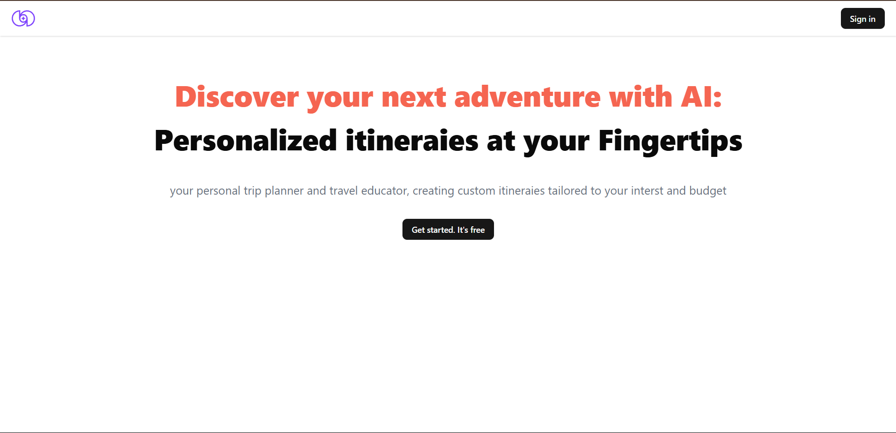
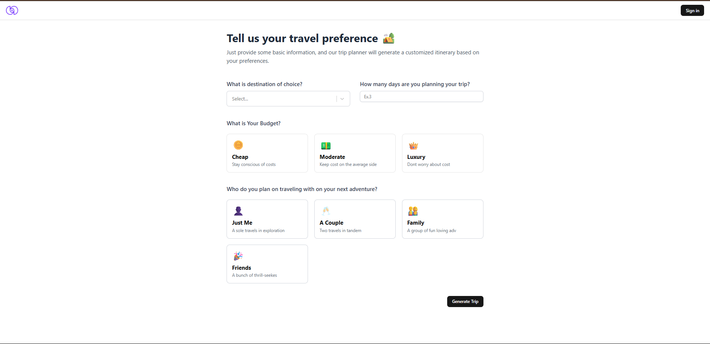
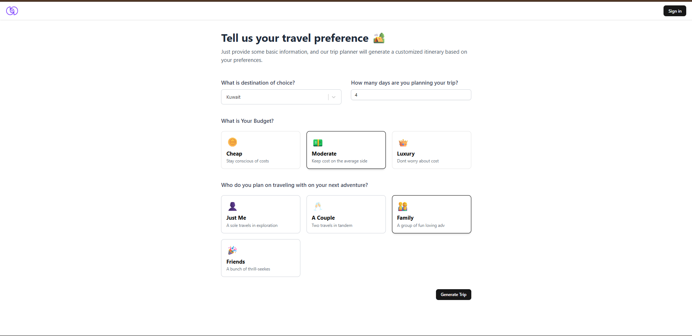
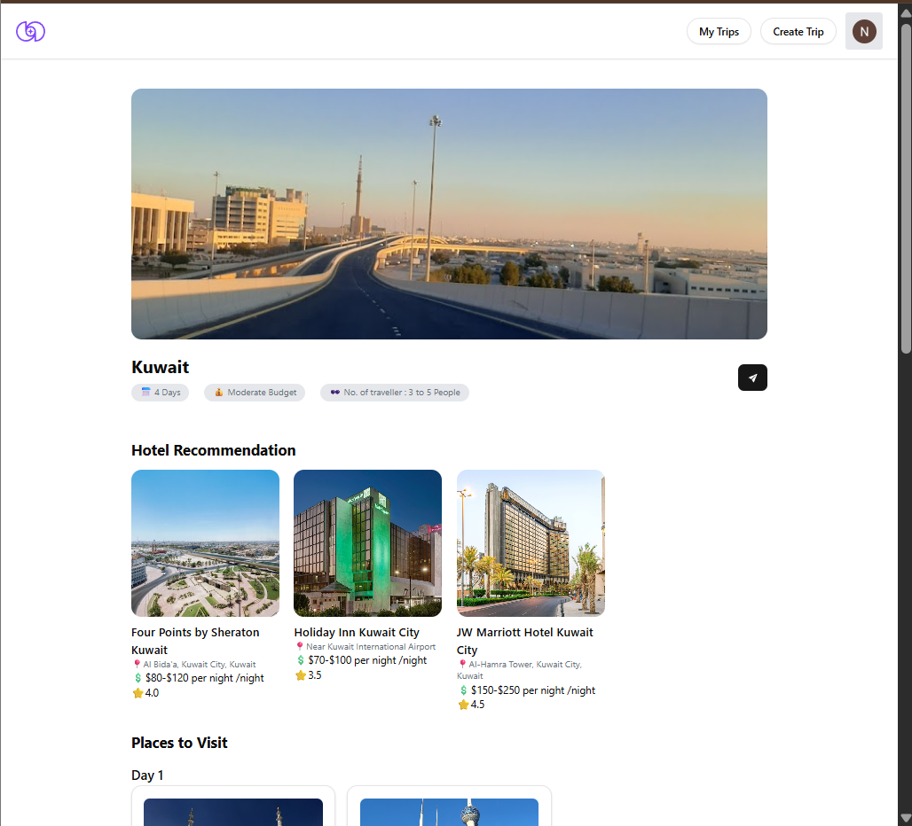
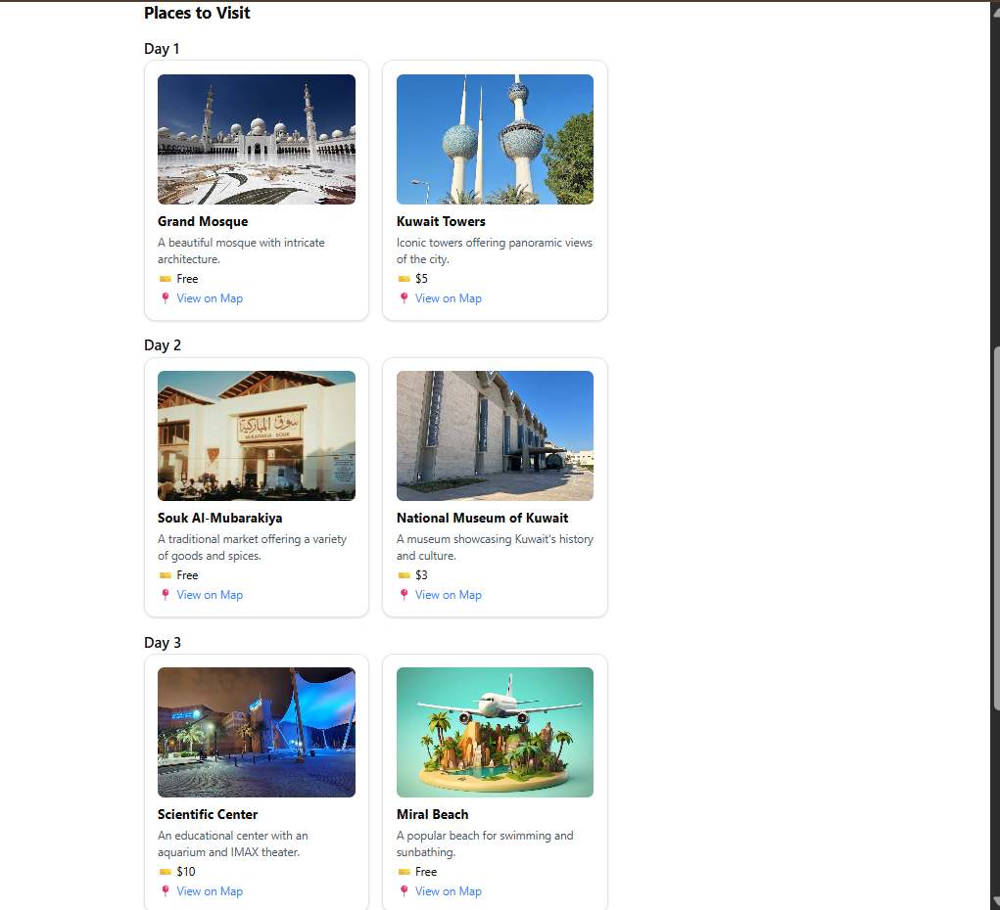
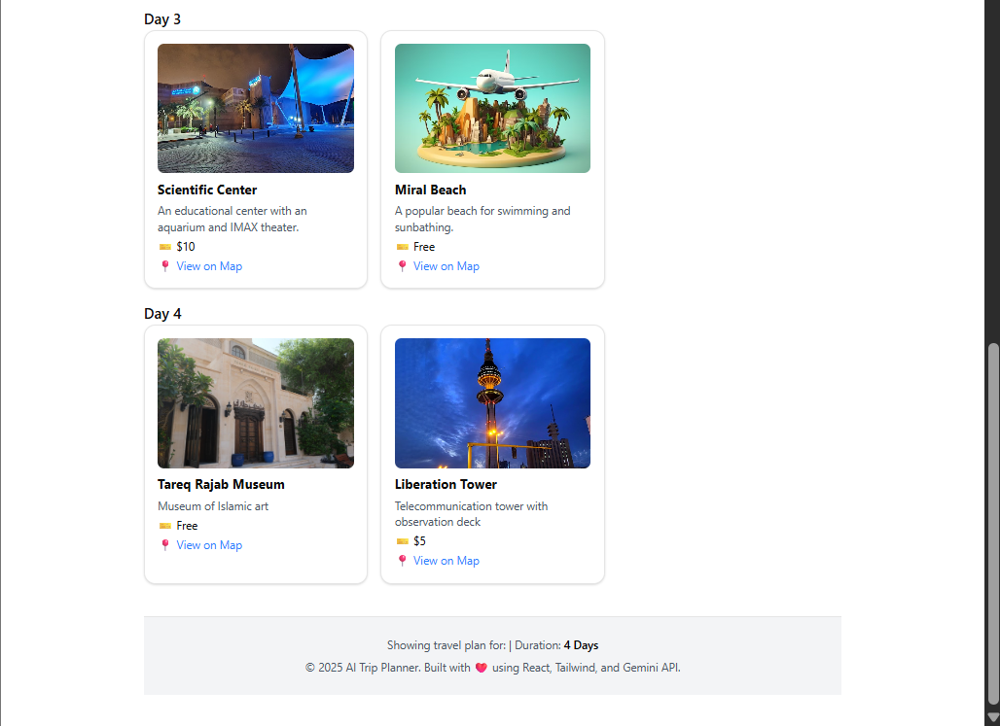
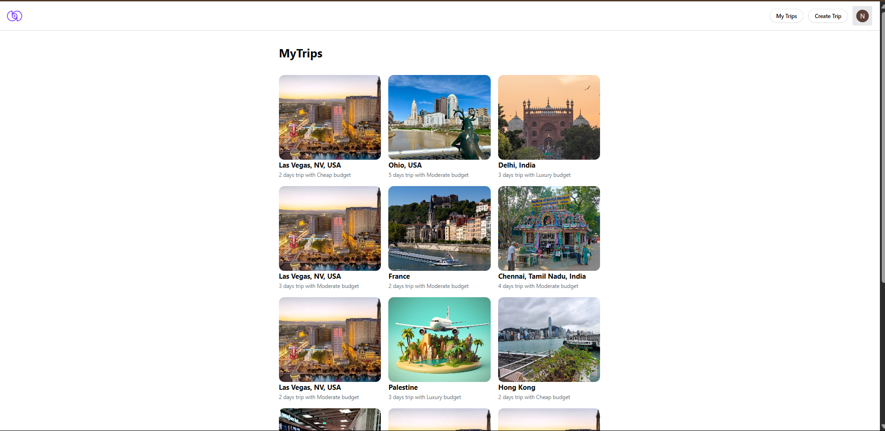

# 🌍 AI-Powered Travel Planner Web Application

## 🔥 Project Overview
This project is an end-to-end **AI-powered personalized travel planner** that allows users to generate customized trip itineraries based on their travel preferences like budget, destination, duration, and group size. With an intuitive user interface and intelligent backend logic, the app automates hotel and sightseeing recommendations to provide users with a seamless trip planning experience.

> 🧠 **Why this stands out**: This isn’t just a static app — it dynamically creates day-wise travel plans tailored to the user's inputs using real-time data integration and modern React design.

---

## 💡 Key Features

### 🎯 Landing Page
- Clean and engaging headline with call-to-action.
- Emphasizes AI-driven itinerary generation.

### ✈️ Trip Preference Form
- Inputs for:
  - Destination
  - Number of days
  - Budget (Cheap, Moderate, Luxury)
  - Travel group (Solo, Couple, Family, Friends)
- Dynamic UI with responsive selection cards.

### 📅 Form Filled Sample
Example selection: kuwait, 4 days, moderate, family

### 🏨 Custom Trip Generator
- On clicking **"Generate Trip"**, user gets:
  - Recommended hotels based on budget.
  - Day-wise places to visit with price, description, and Google Map link.
  - Summary section with trip duration, budget tag, and number of travelers.

### 📁 My Trips Dashboard
- View all previously created trips with:
  - Location thumbnail
  - Duration & budget details
  - Smooth card layout for browsing past plans

---

## 🛠️ Tech Stack
| Technology | Description |
|------------|-------------|
| **React.js** | Frontend UI/UX |
| **Tailwind CSS** | Styling and responsive design |
| **Vite** | Lightning-fast development build tool |
| **Node.js / Express (optional)** | For backend API (if implemented) |
| **Google Places API** | Fetches real hotels and attraction data |
| **React Router** | Page navigation |
| **LocalStorage / Backend DB** | Storing trip history |

---

## 🧠 Skills Demonstrated
- **Frontend Development:** Built a modular React UI with responsive components and visual hierarchy.
- **State Management:** Managed input forms, selection logic, and display states effectively.
- **API Integration:** Integrated Google APIs to fetch real-time data for hotels and places.
- **UX Design:** Ensured minimal clicks to generate a full itinerary.
- **Persistence:** Implemented a trip-saving mechanism using `localStorage` or backend storage.
- **Problem Solving:** Converted user input into structured and visually rich outputs.

---

## 💼 Why This Project Matters to Recruiters
This project replicates a **real-world SaaS travel product**, demonstrating:
- Product thinking: understanding user flows from onboarding to trip generation.
- Frontend mastery: clean layout, clear CTAs, and strong UI/UX principles.
- API usage: ability to integrate and display real-world data.
- Scalability: designed to accommodate more destinations, filters, and features easily.
- Deployment readiness: can be hosted live and used by actual users.

> ✅ **It proves my readiness to contribute to modern full-stack projects or product-focused roles immediately.**

---

## 🖼️ Sample Use Case
**Use Case**: A user selects "kuwait", 4 days, moderate budget, "family".

**Output**:
- Shows 3-star budget hotels with price range.
- Daily itinerary with top-rated places to visit.
- Map links for navigation.
- Trip stored in “My Trips” for future viewing.

---

## 📌 Future Enhancements
- Add user authentication and cloud database (Firebase/MongoDB).
- Integrate flight ticket suggestions.
- Enable sharing or exporting trip plans as PDF.
- Allow real-time travel updates via APIs.

---

## 📌 Links
- **Live Demo**: [AI Trip Planner](https://ai-trip-planner-gold-gamma.vercel.app/)  
- **GitHub Repo**: [GitHub Repository](https://github.com/nikhil22321/AI-trip-planner)

---

## 💬 Final Note
This project is not just about code — it’s about crafting a product that solves a real problem. From design to logic, I built it with the mindset of delivering a real user experience — and that’s what makes me excited to bring the same drive to your team.
